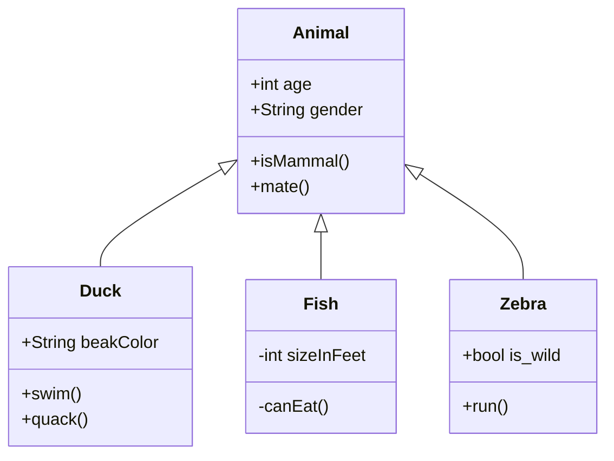

# DL research topics Goodfellow

# A; Linear factor model

## I; Definitions


- A linear factor model is defined by the use of a stochastic, linear decoder function that generates x by adding noise to a linear transformation of h

# B; Auto-encoder

## I; Definitions

https://viblo.asia/p/tan-man-ve-generative-models-part-1-cac-mo-hinh-autoencoder-vaes-4P856rw35Y3

# C; Representation learning

## I; Transfer learning

### 1; zero-shot learning and one-shot learning

## II; Domain adaptions

## III; Multitask learning


<!-- ### 1. Pie chart


### 3. Class diagram


### 4. State diagram
```mermaid!
stateDiagram
[*] --> Still
Still --> [*]

Still --> Moving
Moving --> Still
Moving --> Crash
Crash --> [*]
``` -->
